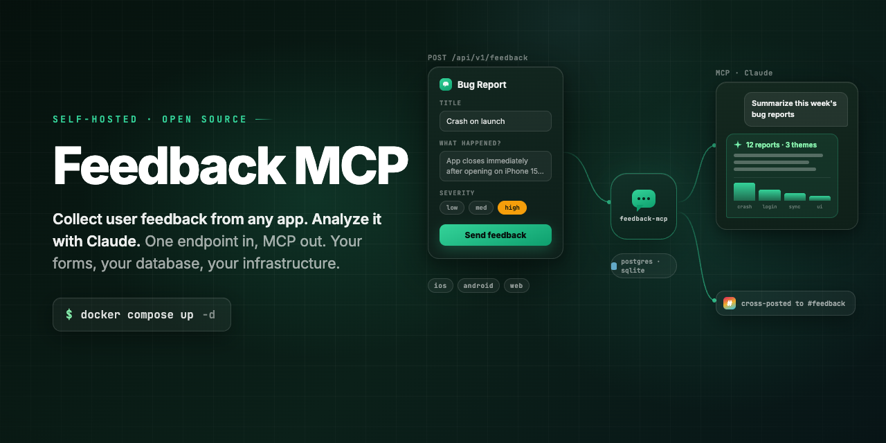

<p align="center">
  
</p>

<p align="center">
  <a href="https://github.com/Parra-Inc/feedback-mcp/actions/workflows/ci.yml"></a>
  <a href="LICENSE"></a>
  
  
  
  
</p>

**Feedback MCP** is a free, open-source, self-hosted service for collecting and analyzing user feedback. Your apps submit feedback to one API endpoint. You (and your AI assistant) read it back through a built-in [MCP](https://modelcontextprotocol.io) server.

There is intentionally no dashboard. Projects and forms are declarative JSON config, feedback lives in your own database, and analysis happens in Claude (or any MCP client): *"summarize this week's bug reports"*, *"what are users asking for most on iOS?"*.

- **One endpoint in.** `POST /api/v1/feedback` from iOS, Android, web, or any backend.
- **MCP out.** `list_feedback`, `search_feedback`, `feedback_stats`, and more at `/api/mcp`.
- **Forms as config.** Each form declares a field schema; submissions are validated with Zod.
- **Your database.** PostgreSQL or SQLite, chosen with one env var.
- **Slack cross-posting.** Optional webhook posts every submission to your team channel.

## Quickstart (Docker)

```bash
git clone https://github.com/Parra-Inc/feedback-mcp.git
cd feedback-mcp
cp apps/server/.env.example .env
# edit .env: set MCP_SECRET and EXAMPLE_APP_INGEST_KEY (openssl rand -hex 32)

docker compose up -d          # SQLite, zero external dependencies
```

Prefer PostgreSQL?

```bash
docker compose -f docker-compose.postgres.yml up -d
```

The server listens on `http://localhost:3000`. Check it:

```bash
curl http://localhost:3000/api/health
# {"status":"ok","database":"ok","config":"ok","projects":1}
```

Submit your first feedback:

```bash
curl -X POST http://localhost:3000/api/v1/feedback \
  -H "Content-Type: application/json" \
  -H "X-Feedback-Key: $EXAMPLE_APP_INGEST_KEY" \
  -d '{
    "project": "example-app",
    "form": "bug-report",
    "platform": "ios",
    "data": {
      "title": "Crash on launch",
      "description": "The app closes immediately after opening.",
      "severity": "high"
    },
    "metadata": { "appVersion": "1.2.0" }
  }'
# {"feedback":{"id":"fb_...","createdAt":"..."}}
```

### One-click deploys

| Platform | |
|---|---|
| **Render** | [](https://render.com/deploy?repo=https://github.com/Parra-Inc/feedback-mcp) (uses `render.yaml`: web service + managed Postgres, auto-generated `MCP_SECRET`) |
| **Vercel** | [](https://vercel.com/new/clone?repository-url=https%3A%2F%2Fgithub.com%2FParra-Inc%2Ffeedback-mcp&root-directory=apps%2Fserver&env=DATABASE_URL,MCP_SECRET&envDescription=Postgres%20connection%20string%20and%20a%20secret%20for%20the%20MCP%20server) (bring a Postgres URL, e.g. from Neon; SQLite does not persist on serverless) |
| **Anywhere with Docker** | `docker build -f apps/server/Dockerfile .` and run with the env vars below. Fly.io, Railway, a VPS: anywhere a container and a volume (or a Postgres) live. |

## Connect Claude

The MCP server is served over streamable HTTP at `/api/mcp`. Two ways to authenticate:

**claude.ai and Claude Desktop (OAuth)**

Add a custom connector with the URL `https://feedback.your-domain.com/api/mcp`. The server implements the MCP OAuth flow (discovery, dynamic client registration, PKCE): claude.ai opens an approval page where you enter your `MCP_SECRET` once, and tokens are issued from there. Rotating `MCP_SECRET` revokes every issued token.

**Claude Code**

```bash
claude mcp add --transport http feedback https://feedback.your-domain.com/api/mcp \
  --header "Authorization: Bearer <MCP_SECRET>"
```

**Any MCP client (`.mcp.json`)**

```json
{
  "mcpServers": {
    "feedback": {
      "command": "npx",
      "args": [
        "-y", "mcp-remote",
        "https://feedback.your-domain.com/api/mcp",
        "--header", "Authorization: Bearer ${MCP_SECRET}"
      ]
    }
  }
}
```

### MCP tools

| Tool | What it does |
|---|---|
| `list_projects` | All configured projects with their platforms and forms |
| `get_project` | One project by slug |
| `list_forms` / `get_form` | Form definitions, including field schemas |
| `list_feedback` | Feedback for a project, newest first, with form / platform / date filters and cursor pagination |
| `get_feedback` | A single submission by id |
| `search_feedback` | Full-text search across submission data and metadata |
| `feedback_stats` | Counts grouped by `platform`, `form`, or `day` |

## Configuration

Projects and forms are files, not database rows. The server loads and validates everything under `config/` at boot (and on every request in dev), so adding a project is a pull request, and LLMs can edit your forms as easily as you can.

```
apps/server/config/
  projects/
    example-app/
      project.json
      forms/
        bug-report.json
        feature-request.json
```

### `project.json`

```json
{
  "slug": "example-app",
  "name": "Example App",
  "platforms": ["ios", "android", "web"],
  "ingestKeys": [{ "id": "default", "secretEnv": "EXAMPLE_APP_INGEST_KEY" }],
  "auth": {
    "jwt": {
      "issuer": "https://auth.your-domain.com",
      "audience": "example-app",
      "algorithms": ["RS256"],
      "jwksUrl": "https://auth.your-domain.com/.well-known/jwks.json",
      "required": false
    }
  },
  "slackWebhookEnv": "EXAMPLE_APP_SLACK_WEBHOOK"
}
```

| Field | Required | Description |
|---|---|---|
| `slug` | yes | Must match the directory name |
| `name` | yes | Display name |
| `description` | no | Shown in the read API and MCP |
| `platforms` | no | Allowed `platform` values for submissions. Omit to allow any. |
| `ingestKeys` | yes | Keys that authorize submissions. `secretEnv` names the env var holding the secret, so no secrets live in git. |
| `auth.jwt` | no | Verify end-user tokens on submission (see below) |
| `slackWebhookEnv` | no | Env var naming a per-project Slack webhook (overrides `SLACK_WEBHOOK_URL`) |

### Form files (`forms/<slug>.json`)

```json
{
  "slug": "bug-report",
  "name": "Bug Report",
  "fields": [
    { "name": "title", "type": "string", "required": true, "max": 120 },
    { "name": "description", "type": "string", "required": true },
    { "name": "severity", "type": "enum", "values": ["low", "medium", "high", "critical"] },
    { "name": "email", "type": "email" }
  ]
}
```

Submissions are validated against the form's fields with Zod. Unknown keys are rejected.

| Field type | Options | Validates as |
|---|---|---|
| `string` | `min`, `max`, `pattern` | string with length / regex constraints |
| `number` | `min`, `max` | number in range |
| `boolean` | | boolean |
| `enum` | `values` (required) | one of the listed strings |
| `email` | | email address |
| `url` | | URL |
| `date` | | ISO 8601 date or datetime |

Every field also accepts `label`, `description`, and `required` (default `false`).

## Authentication

Three separate credentials, three separate jobs:

| Credential | Sent as | Grants |
|---|---|---|
| **Ingest key** | `X-Feedback-Key: <key>` | Submitting feedback to one project. Safe to embed in clients as a spam deterrent; treat it as public. |
| **End-user JWT** (optional) | `Authorization: Bearer <jwt>` on submission | Attaches a verified user identity (`sub`) to the feedback. You configure how your tokens are verified per project: `jwksUrl`, `publicKeyEnv` (PEM), or `secretEnv` (HMAC), plus optional `issuer`, `audience`, `algorithms`, and `required`. |
| **MCP secret** | `Authorization: Bearer <MCP_SECRET>` | Reading everything: the admin REST API and the MCP server. Keep it secret. |

## REST API

Ingest (CORS-open, ingest key):

| Method | Path | Description |
|---|---|---|
| `POST` | `/api/v1/feedback` | Submit feedback: `{ project, form, platform?, data, metadata? }` |

Read and manage (requires `Authorization: Bearer <MCP_SECRET>`):

| Method | Path | Description |
|---|---|---|
| `GET` | `/api/v1/projects` | List projects |
| `GET` | `/api/v1/projects/:slug` | One project |
| `GET` | `/api/v1/projects/:slug/forms` | Forms for a project |
| `GET` | `/api/v1/projects/:slug/feedback` | Feedback with `form`, `platform`, `since`, `until`, `limit`, `cursor` query params |
| `DELETE` | `/api/v1/projects/:slug/feedback` | Bulk delete with `user`, `form`, `platform`, `before` filters (or `all=true`). Covers GDPR erasure requests. |
| `GET` | `/api/v1/projects/:slug/export` | Stream every submission as NDJSON (backups, portability) |
| `GET` | `/api/v1/feedback/:id` | One submission |
| `DELETE` | `/api/v1/feedback/:id` | Delete one submission |
| `GET` | `/api/health` | Health check (no auth) |

## Rate limiting

The ingest endpoint is rate limited out of the box: per client IP (default 60/min) and per project (default 600/min), returning `429` with a `Retry-After` header. Tune or disable with `RATE_LIMIT_IP_PER_MINUTE` and `RATE_LIMIT_PROJECT_PER_MINUTE` (`0` disables). The limiter is in-process; if you run multiple replicas or serverless, add a shared limit at your reverse proxy.

## Data lifecycle

- **Delete**: remove a single submission by id, or bulk delete by user, form, platform, or age (see the table above). Deleting by `user` handles GDPR/CCPA erasure requests.
- **Export**: stream a project's entire history as NDJSON for backups or offline analysis.
- **Retention**: set `FEEDBACK_RETENTION_DAYS` and feedback older than the window is deleted automatically (swept at most hourly, piggybacking on ingest traffic; no cron needed).

## Environment variables

| Variable | Required | Description |
|---|---|---|
| `MCP_SECRET` | yes | Bearer secret for the MCP server, admin API, and OAuth flow. `openssl rand -hex 32` |
| `DATABASE_PROVIDER` | no | `postgresql` (default) or `sqlite` |
| `DATABASE_URL` | no | Connection string. Defaults: local Postgres on `:5457`, or `file:./data/feedback.db` for SQLite |
| `SLACK_WEBHOOK_URL` | no | Slack incoming webhook; every submission is cross-posted after the database write |
| `RATE_LIMIT_IP_PER_MINUTE` | no | Ingest requests per minute per client IP (default `60`, `0` disables) |
| `RATE_LIMIT_PROJECT_PER_MINUTE` | no | Ingest requests per minute per project (default `600`, `0` disables) |
| `FEEDBACK_RETENTION_DAYS` | no | Auto-delete feedback older than this many days (unset keeps everything) |
| `PUBLIC_URL` | no | Public origin used in OAuth discovery metadata when behind a proxy, e.g. `https://feedback.your-domain.com` |
| `CONFIG_DIR` | no | Override the config directory (default `config/` in the app root) |
| *per-project vars* | | Whatever your `project.json` files reference via `secretEnv`, `slackWebhookEnv`, `publicKeyEnv` |

See [apps/server/.env.example](apps/server/.env.example) for a documented template.

## Databases

The Prisma schema is a single portable `Feedback` table, so switching providers is one env var:

- **PostgreSQL** (default): production-ready, uses the `@prisma/adapter-pg` driver adapter, with real migration history (`prisma migrate deploy` runs on container start).
- **SQLite**: perfect for a single container with a volume. Zero external services. Schema is applied with `prisma db push`, which refuses destructive changes.
- **MongoDB**: on the roadmap, currently blocked on a Prisma 7 driver adapter.

The provider is baked into the Prisma schema at generate time; `pnpm db:sync` (or the Docker entrypoint) rewrites it from `DATABASE_PROVIDER` automatically.

## Slack cross-posting

Set `SLACK_WEBHOOK_URL` (or a per-project `slackWebhookEnv`) and every accepted submission is posted to Slack as a Block Kit message with the project, form, platform, user, and submitted fields. Posting happens after the database write and never fails a request: if Slack is down, you just miss the ping, not the feedback.

## Development

```bash
pnpm install
pnpm up                          # local Postgres on :5457 (or use sqlite below)
pnpm db:sync                     # generate client + push schema
MCP_SECRET=dev EXAMPLE_APP_INGEST_KEY=dev pnpm dev   # server on :3060
```

- SQLite instead: `DATABASE_PROVIDER=sqlite pnpm db:sync && DATABASE_PROVIDER=sqlite ... pnpm dev`
- Unit tests: `pnpm --filter @feedback-mcp/server test`
- End-to-end smoke test: `pnpm --filter @feedback-mcp/server smoke`
- Prisma Studio: `pnpm --filter @feedback-mcp/server db:studio` (`:5560`)
- Marketing site: `pnpm dev:site` (`:3061`), deployed to GitHub Pages from `apps/site`

Repo layout:

```
apps/server   the self-hosted app: ingest API + read API + MCP server + OAuth
apps/site     the marketing one-pager (static export, GitHub Pages)
assets        open-assets project for the banner and social images
examples      copy-paste client snippets (Swift, TypeScript)
```

See [CONTRIBUTING.md](CONTRIBUTING.md) for the full guide and [SECURITY.md](SECURITY.md) for reporting vulnerabilities. Client integration snippets live in [examples/](examples/).

## Roadmap and non-goals

Planned:

- MongoDB support (blocked on a Prisma 7 driver adapter)
- A `delete_feedback` MCP tool (destructive operations are REST-only for now)
- Drop-in feedback form widgets

Non-goals, by design:

- **A web dashboard.** The read API, MCP tools, and Slack are the interface. Your AI assistant is the dashboard.
- **A hosted SaaS.** Feedback MCP is self-hosted; your feedback lives in your database.

## License

[MIT](LICENSE) © Parra, Inc.
